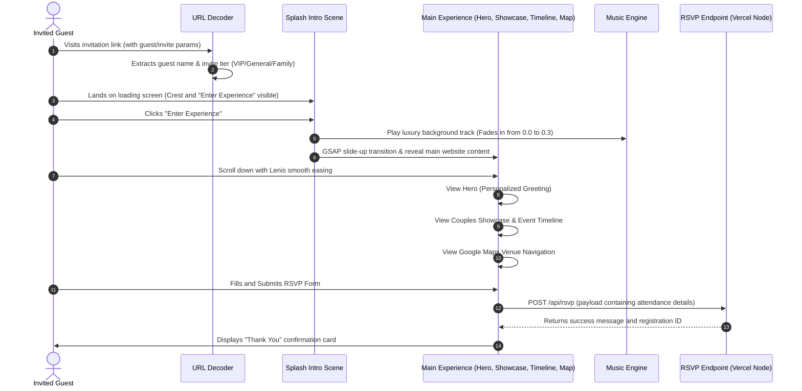

# Sahakar Celebration Portal - Appflow and Navigation Document

## 1. User Journey Flow
The portal operates as a single-page application (SPA) structured as a choreographed journey. The path from initial link click to RSVP confirmation is mapped below:

---

## 2. Interactive Navigation States

### 2.1 Audio State Machine
* **Init (Default)**: Volume is at `0`. State is unplayed.
* **Consent Granted (Enter Clicked)**: Player executes `play()`, fading volume up to `0.3` over 2 seconds.
* **User Manual Toggle (Mute Button)**: Smoothly fades volume down to `0` over 1 second, then pauses. Toggling back plays and fades volume to `0.3`.
* **Tab Focus Loss (visibilitychange)**: Fades volume to `0` and pauses. Resuming tab focus restarts play and fades back to `0.3`.

### 2.2 Content Easing & Layout
* **Smooth Easing**: Governed by Lenis to ensure uniform velocity across varying trackpads and mouse wheels.
* **Conditional Visibility**: The RSVP "Total Guests" input is hidden unless the user selects "Accepts With Pleasure".
